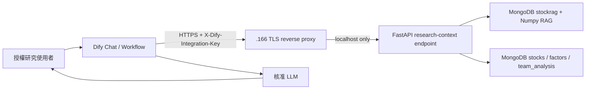

# Dify 研究助理導入 SDD

**狀態：** 暫緩；不作為導入決策  
**決策日期：** 2026-10-09  
**權威環境：** `172.16.9.166` (`ming-ai02`)

## 1. 目標與非目標

### 目標

本文件保留先前的 Dify 方案評估，但目前**不導入 Dify、不實作本文件中的 API 或基礎設施**。
後續設計依 [台股研究上下文 SDD](2026-10-09-research-context-sdd.md) 為準；任何平台選型必須在
該 SDD 驗收後另立決策紀錄。

### 非目標

- 不讓 Dify 直連 MongoDB、Ollama 或主機檔案系統。
- 不把現有文件匯入 Dify Knowledge Base；權威檢索仍是 MongoDB + Numpy + bigram + RRF + 時間衰減。
- 不讓 Dify 寫入資料、觸發交易、啟動排程或修改任何合議定案。
- 不在 `.166` 安裝 Docker、Dify、PostgreSQL 或 Redis。

## 2. 正式機事實與架構決策

`.166` 的 FastAPI 服務為 `src/api/server.py`，只監聽 `127.0.0.1:8888`；既有 API 無認證，
且 Nginx 與容器執行環境皆不存在。Dify 因此部署於**獨立的內網 VM 或受管容器平台**，不得直接暴露
既有 API。`.166` 新增一個只代理 Dify 整合路徑的 TLS reverse proxy：只允許 Dify 主機 IP，
並轉送至本機 `127.0.0.1:8888`。



## 3. 邏輯契約

### 請求

`POST /api/integrations/dify/research-context`

標頭：`X-Dify-Integration-Key: <secret>`

```json
{
  "question": "2330 目前的研究結論與主要風險？",
  "symbols": ["2330"],
  "max_sources": 4
}
```

驗證規則：`question` 去除空白後長度為 2 至 500；`symbols` 最多 6 筆、每筆必須為四碼數字；
`max_sources` 為 1 至 8。拒絕未定義欄位。

### 成功回應

```json
{
  "as_of": "2026-10-09T15:30:00+08:00",
  "question": "2330 目前的研究結論與主要風險？",
  "stocks": [{"symbol": "2330", "team": {}, "factors": {}}],
  "citations": [{
    "id": "rag:docs/adr/0021-RAG向量檢索維持MongoDB加Numpy.md:0",
    "title": "RAG 向量檢索維持 MongoDB 加 Numpy",
    "path": "docs/adr/0021-RAG向量檢索維持MongoDB加Numpy.md",
    "chunk_idx": 0,
    "document_date": "2026-10-09",
    "age_days": 0,
    "score": 0.021,
    "excerpt": "..."
  }],
  "warnings": []
}
```

不回傳 MongoDB `_id`、角色完整 prompt、環境變數、堆疊追蹤或未清理的內部文件欄位。
找不到標的時，回傳 HTTP 200、`stocks` 中該標的為 `null`，並在 `warnings` 加入
`"找不到 2330 的可用資料"`；這是資料不足，不是服務失敗。

### 失敗回應

| 情境 | HTTP 狀態 | 回應 |
|---|---:|---|
| 無效或缺失金鑰 | 401 | `{"detail":"unauthorized"}` |
| 請求格式不符 | 422 | FastAPI 驗證回應 |
| RAG 或 MongoDB 暫時不可用 | 503 | `{"detail":"research context unavailable"}` |
| 超過每把金鑰 30 requests/minute | 429 | `{"detail":"rate limit exceeded"}` |

## 4. 元件設計

| 元件 | 責任 |
|---|---|
| `src/api/dify_models.py` | Pydantic 請求/回應模型與欄位驗證 |
| `src/api/dify_auth.py` | 以 `hmac.compare_digest` 驗證 `DIFY_INTEGRATION_API_KEY`；固定 401 回應 |
| `src/api/research_context.py` | 組合 RAG、最新 team analysis 與 factors；清理為明確回應模型 |
| `src/api/rag_cache.py` | 以 `RAG_CACHE_TTL_SECONDS=600` 快取 `stockrag_search.load()` 結果；逾時才重載 |
| `src/api/server.py` | 僅註冊 `POST /api/integrations/dify/research-context`；不改變既有端點 |
| `deploy/nginx/twstock-dify.conf` | TLS、Dify IP allowlist、路徑限定代理與請求大小限制 |

整合端點只能讀取 `team_analysis`、`stock_factors` 與 `stockrag.docs`。資料查詢、RAG 載入、
日期轉換與輸出清理都必須在 Python 元件內完成，Dify 僅接收已清理的 JSON。

## 5. Dify Workflow

建立一個 Chatflow，依序為：

1. Start：接收 `sys.query`。
2. Question Guard：空白問題直接回覆「請提供具體研究問題」。
3. HTTP Request：以 POST 呼叫 `research-context`，設定 `X-Dify-Integration-Key`，timeout 15 秒。
4. Template：把 `as_of`、`stocks`、`citations`、`warnings` 序列化為模型上下文。
5. LLM：system prompt 限定只能根據該 JSON 回答，資料不足須明說；每個事實段落附 citation `id`。
6. Answer：輸出繁體中文、資料日期、引用清單與「非投資建議」。

Workflow 不使用 Dify Knowledge Retrieval 節點、不啟用 Agent 自主工具選擇、不配置任何寫入 HTTP Tool。

## 6. 組態、安全與維運

- `.166/.env`：加入祕密 `DIFY_INTEGRATION_API_KEY=`，僅透過安全通道設定；`.env.example` 僅保留空值與用途說明。
- Dify 主機保存同一把 key 的 secret reference，不寫入 Workflow、Git、log 或截圖。
- reverse proxy 僅聽 private interface 的 `9443`，allowlist 只含 Dify 主機固定 IP；拒絕其他路徑與來源。
- TLS 使用內部 CA 或受管憑證；Dify 必須驗證 CA，不允許略過 TLS 驗證。
- Dify 採獨立 VM/平台、固定版號與不可變映像 digest；其 PostgreSQL、Redis、檔案卷依 Dify 官方支援矩陣備份與演練還原。
- API 僅記錄 request id、HTTP 狀態、耗時、citation 數與錯誤類別；不得記錄問題全文、金鑰或原始研究內容。
- weekly RAG ingest 完成後，服務最多於 10 分鐘 TTL 後看見新資料；若需立即生效，部署排程以 localhost-only 管理端點清除快取，該端點不經 proxy 對 Dify 開放。

## 7. 驗收標準

1. 未授權、錯誤金鑰、格式錯誤、限流與後端故障有穩定且不洩密的回應。
2. 授權請求可取得至多 8 筆、具有路徑/日期/分數的引用，並保留現有 RAG 排序語意。
3. 正式 Dify Workflow 的正常、無資料、RAG 503 三條路徑皆可在測試環境端到端驗證。
4. `.166` 的既有 `/api/*` 行為、dashboard、weekly ingest 與 RAG 測試均不退化。
5. proxy 只允許 Dify 主機至 `/api/integrations/dify/`；非 allowlist 來源無法存取。
