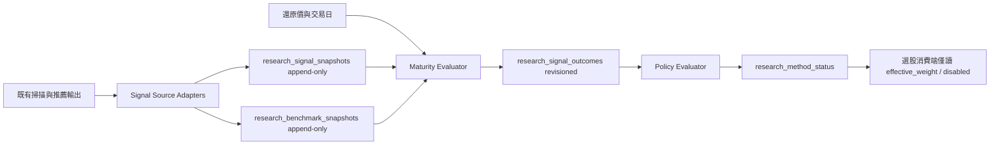

# 研究訊號成效帳本 SDD

**狀態：** Proposed  
**日期：** 2026-10-10  
**權威環境：** `172.16.9.166`

## 1. 目標

建立一個與既有選股器及風控器分離的研究訊號成效帳本。它每天以不可覆寫的形式保存每個方法產生的候選、推薦、進出場與風控判斷；在 5、10、20 個交易日成熟後，以還原價、明確基準與台股成本統一計算毛／淨績效；最後只可降低方法的有效權重或停用方法。

本設計的目的不是自動調參、重新訓練模型或改寫既有回測。它要補齊「哪些方法在何時提出何種判斷，結果如何」的可審計歷史。

## 2. 非目標與約束

- 不導入 Dify，不改動 live 下單、持倉或既有選股規則。
- 不以 `schedule_alerts` 作方法狀態；告警是事件，方法狀態是目前值。
- 不把可覆寫的 `vcp_candidates`、`core_watchlist` 或最新 JSON/CSV 視為歷史帳本。
- 不以短期績效自動提高權重、改變門檻或挑選新參數。
- 不進行未經審計的歷史回填。V1 從上線後的新快照開始；任何回填是另一份批准的資料修復工作。
- 所有 MongoDB 寫入經既有 `write_db` 測試 fixture；單元測試一律使用 fake repository，不連正式 MongoDB。

## 3. 名詞與範圍

本設計使用 [CONTEXT.md](../../CONTEXT.md) 的「研究訊號快照」「成熟結果」「方法狀態」定義。

V1 必須可擷取下列來源；不支援某來源時，capture run 要寫出明確 `unsupported` 狀態，不能靜默遺漏：

1. 每日研究名單：謝富旭存股、成長精選、股利、深度分析、watchlist；阿甘；因子排名；品質成長；research screen；daily picks。
2. 量化策略：多因子 v21、核心池、2560、跌深反彈、MA／法人。
3. 技術與型態：SenVision、OBV、量價、VCP、雙訊號。
4. 籌碼：主力／散戶、股東集中度。
5. 風控：北大四大法則、持倉風控、post-trigger。
6. AI：team / Buyside final verdict、新聞價值、pairs / live advisor。

`pairs`、`live advisor` 與按需 API 如果當日沒有產生實際訊號，仍要在 capture run 中記為 `no_output`，不應假裝有候選。

## 4. 架構



來源轉接器只讀既有集合與檔案。capture 成功或失敗都寫入 `research_signal_capture_runs`，使缺來源本身可被監控。評估器只讀快照、基準快照與 `stock_price`；不得回頭以「目前最新候選」替代歷史來源資料。

## 5. 資料契約

所有 Pydantic 模型繼承既有 `StrictModel`，設定 `extra="forbid"`。

### 5.1 `ResearchSignalSnapshot`

```python
class SignalDirection(StrEnum):
    LONG = "long"
    SHORT = "short"
    RISK_REDUCE = "risk_reduce"
    HOLD = "hold"
    OBSERVE = "observe"

class ResearchSignalSnapshot(StrictModel):
    snapshot_key: str = Field(min_length=32, max_length=64)
    source: str = Field(pattern=r"^[a-z][a-z0-9_]{2,63}$")
    source_event_id: str = Field(min_length=1, max_length=200)
    symbol: Symbol
    analysis_date: date
    available_at: datetime
    captured_at: datetime
    signal_kind: str = Field(min_length=1, max_length=80)
    direction: SignalDirection
    evaluation_enabled: bool
    score: float | None = Field(default=None, ge=0, le=100)
    rule_version: str = Field(min_length=1, max_length=80)
    price_at_signal: float = Field(gt=0)
    source_payload: dict[str, JsonValue]
    benchmark_profile: str = Field(min_length=1, max_length=80)
    cost_profile: str = "tw_cash_default_v1"
```

- `snapshot_key` 是 canonical JSON 的 SHA-256：`source`、`source_event_id`、`symbol`、`analysis_date`、`signal_kind`、`direction`、`rule_version`。
- `source_event_id` 必須指向來源批次，不可使用「latest」；檔案來源用內容雜湊加檔案日期，Mongo 來源用來源 `_id` 加分析日。
- `source_payload` 僅保存評估需要的、已標準化欄位，例如原始分數、標籤、門檻與證據 id；不得保存 LLM 全文或重複整份來源文件。
- `evaluation_enabled=False` 適用純觀察、持有、資訊性或沒有方向性判斷的輸出。它可保存與顯示，但不參與降權門檻。
- 捕捉器只能 `insert_one`。重試遇到 `snapshot_key` duplicate key 時視為 idempotent success；禁止 `$set`、replace 或 delete。

MongoDB index：

```text
research_signal_snapshots
  unique(snapshot_key)
  (analysis_date, source, symbol)
  (source, signal_kind, analysis_date)
```

### 5.2 `ResearchBenchmarkSnapshot`

```python
class ResearchBenchmarkSnapshot(StrictModel):
    benchmark_key: str
    profile: Literal["market_equal_weight_liquid_tw_v1", "analysis_pool_v1"]
    analysis_date: date
    symbol_count: int = Field(ge=1)
    symbols: list[Symbol] = Field(min_length=1)
    membership_hash: str
    captured_at: datetime
```

- `market_equal_weight_liquid_tw_v1` 為當日具有足夠價格與流動性資料的台股等權集合。
- `analysis_pool_v1` 僅供 AI team verdict 使用，代表實際分析池。
- 每個來源快照必須引用一個 benchmark profile；評估器使用保存的成員名單而不是今日 universe。
- 兩種超額報酬分別命名為 `excess_mkt_pct` 與 `excess_pool_pct`，不可用未指名的「超額」。

### 5.3 `ResearchSignalOutcome`

```python
class ResearchSignalOutcome(StrictModel):
    outcome_key: str
    snapshot_key: str
    horizon_trading_days: Literal[5, 10, 20]
    revision: int = Field(ge=1)
    entry_date: date
    exit_date: date
    entry_adj_close: float = Field(gt=0)
    exit_adj_close: float = Field(gt=0)
    direction: SignalDirection
    gross_return_pct: float
    net_return_pct: float
    excess_mkt_pct: float | None
    excess_pool_pct: float | None
    hit: bool | None
    cost_pct: float = Field(ge=0)
    price_data_as_of: datetime
    evaluated_at: datetime
    supersedes_outcome_key: str | None = None
```

- 進場日是 `available_at` 後第一個可交易日；出場日是進場日起第 $N$ 個有效交易日。兩者都使用 `adj_close`，避免除權息造成假報酬。
- LONG：$gross=(exit/entry-1)\times100$；SHORT 和 RISK_REDUCE：$gross=(entry/exit-1)\times100$。HOLD／OBSERVE 的 `hit` 為 `None`，只保存觀察報酬。
- `cost_pct` 使用 `src.backtesting.tw_costs.roundtrip_pct(discount)`；V1 預設無折、非當沖。$net=gross-cost$。
- `excess_mkt_pct` 是同一 benchmark snapshot 所有可計算成員的等權毛報酬，按 direction 轉換後再相減；`excess_pool_pct` 只在有 `analysis_pool_v1` 時計算。
- `hit=True` 當且僅當 `net_return_pct > 0` 且已計算的指定超額報酬大於 0。缺價、停牌或基準不足必須記錄不可評估理由，不能以 0 補值。
- 同一 `(snapshot_key, horizon_trading_days)` 的第一筆 outcome 是 revision 1。價格資料修訂時只能新增 revision 2 以上，並以 `supersedes_outcome_key` 串連；禁止更新 revision 1。

MongoDB index：

```text
research_signal_outcomes
  unique(snapshot_key, horizon_trading_days, revision)
  (snapshot_key, horizon_trading_days, revision desc)
  (horizon_trading_days, evaluated_at)
```

### 5.4 Capture run 與方法狀態

`research_signal_capture_runs` 保存 `run_id`、`as_of`、每個 source 的 `captured`／`duplicate`／`no_output`／`unsupported`／`failed` 數量及錯誤摘要。它是 run audit，不是訊號資料。

`research_method_status` 每個 `(source, signal_kind, policy_version)` 一筆目前狀態：

```python
class MethodStatus(StrictModel):
    source: str
    signal_kind: str
    policy_version: str
    state: Literal["observe", "active", "degraded", "disabled"]
    effective_weight: float = Field(ge=0, le=1)
    evaluated_horizon: Literal[20]
    sample_size: int = Field(ge=0)
    independent_analysis_days: int = Field(ge=0)
    failure_streak: int = Field(ge=0)
    reason: str
    decided_at: datetime
    evidence_outcome_keys: list[str]
```

這是可覆寫的「現在狀態」，但每次變更都必須新增一筆 `research_method_status_history`。`schedule_alerts` 只在狀態轉變時新增事件。

## 6. 捕捉流程

新增 `src/research_signal_ledger/sources/`，每個來源一個 adapter，實作：

```python
class SignalSource(Protocol):
    name: str
    def collect(self, as_of: date) -> list[ResearchSignalSnapshot]: ...
```

V1 adapter 群組：

- `daily_picks`: 因子、SenVision、謝富旭、阿甘、品質成長。
- `research_screen`: 因子 300 檔研究清單。
- `team_analysis`: team / Buyside verdict 與新聞欄位。
- `core_watchlist`: 核心池、2560、量價、跌深反彈與 MA／法人訊號。
- `technical`: SenVision、OBV、量價、VCP、雙訊號。
- `chip`: 主力／散戶與股東集中度。
- `risk`: 北大四大法則、風控合議與 post-trigger。
- `on_demand`: 謝富旭股利／深度分析、pairs、live advisor；只有當日有持久化輸出時才擷取。

新增 `scripts/capture_research_signals.py --as-of YYYY-MM-DD`，在晚間 pipeline 的所有來源輸出完成後執行。單一 adapter 失敗不可阻斷其他 adapter，但 capture run 必須為 failed，並寫一則去重的 `schedule_alerts`。

## 7. 成熟評估與成本

新增 `scripts/evaluate_research_signals.py --horizons 5,10,20`，每天在收盤資料同步後執行：

1. 找到尚未有該 horizon 最新 revision outcome 的 `evaluation_enabled=True` snapshot。
2. 依保存的 `available_at` 找到進場與出場交易日；資料尚未成熟則跳過，不寫失敗。
3. 讀取還原價、保存基準成員的同期還原價、台股 round-trip 成本。
4. append outcome；遇價格資料修訂才 append 新 revision。
5. 輸出每個 source/horizon 的完成、尚未成熟、缺價與失敗數。

不在 capture 當日使用未來價格，也不以來源的現在分數覆蓋歷史分數。

## 8. 降權／停用治理

新增 `scripts/evaluate_research_method_policy.py --horizon 20 --policy-version v1`。只使用每個 snapshot 的最新 outcome revision，且只納入 `evaluation_enabled=True`。

V1 門檻：

- 至少 60 個成熟訊號且至少 20 個不同分析日，否則維持 `observe`。
- 一輪失敗為平均 `net_return_pct <= 0` 且平均 `excess_mkt_pct <= 0`，或 hit rate `< 50%`。
- **一輪的定義**：距上次決策至少新增 5 個分析日才算新一輪（`min_new_analysis_days`）。否則同一批資料每天排程都會被當成新的一輪，與證據量無關地降權。
- 連續兩輪失敗：`observe` 或 `active` → `degraded`，`effective_weight` 乘以 0.75。
- `degraded` 後再連續兩輪失敗（累計第 4 輪）：`disabled`，`effective_weight=0`。
- 證據充足且表現良好的 `observe` 維持 `observe`，不會自動晉升為 `active`；任何重新啟用或提高權重，都需要新的人工 `policy_version`、樣本外報告及明確核准紀錄。
- source consumer 在 enforcement 開啟前只顯示狀態；V1 預設 `observe`，不影響 live 選股。啟用 enforcement 是另一個批准任務。

**語意修正紀錄**：初版只允許 `active → degraded`，但沒有任何自動流程會把方法設為 `active`，導致所有方法永遠停在 `observe`，政策形同空轉。因此改為允許證據充足的 `observe` 降權。這只會降低權重，仍是單向且保守的。

狀態寫入：`research_method_status` 是目前值，每次決策以 `replace_one` 更新；`research_method_status_history` 為 append-only，先寫歷程再更新現態，使中途失敗時不會留下無紀錄的狀態變更。沒有新一輪且狀態未變時不寫入，每日排程不會產生歷程噪音。

方法狀態變更才寫 `schedule_alerts`，避免每日重複告警。任何門檻或 policy version 變更都需 ADR，因為它改變治理行為。

## 9. 安全與可觀測性

- 來源資料不可用、沒有輸出、unsupported 與 adapter 失敗必須區分。
- **失敗告警**：capture 有來源 `failed` 時，每次 run 寫一則 `schedule_alerts`（`source=research_signal_ledger`，列出所有失敗來源），24 小時去重；全部恢復後自動消解，恢復後再失敗會再告警。`no_output` 與 `unsupported` 不算失敗。
- **如期產生**：`research_signal_snapshots` 登記為 FR-OUT-001（`output_freshness.py`，`captured_at`，容許 4 天），它能抓到「cron 根本沒跑」這種沒有任何程式碼可寫告警的失效。`research_signal_outcomes` 要等首批 5 日成熟（約 2026-10-20）有資料後才登記，否則會讓 FR-OUT-001 憑空變成 ⚪。
- **新鮮度審核豁免**：6 個帳本 collection 加入 `data_freshness_audit.py` 的 `EXEMPT`（每項附理由）。該審核只認 `date` 欄位，帳本用 `analysis_date`／`as_of`／`captured_at`，且 outcomes 前幾天必然為空。豁免是明說的決定，替代監控即上面兩項。
- 尚未實作：成熟延遲檢查（outcome 落後超過兩個交易日）。需要首批 outcome 出現後才有意義。
- 原始 payload 不可包含 API key、prompt、完整新聞正文或敏感設定。
- Dashboard 只讀帳本，顯示來源、規則版本、樣本數、5/10/20 日毛／淨／超額、方法狀態與最後 capture 時間；不可從 UI 直接改權重。

## 10. 驗收

1. 相同來源批次重跑兩次，snapshot 文件數不增加且既有 snapshot 的 BSON 完全不變。
2. 不同日期或不同 rule version 的同標的訊號會各自保存。
3. 5/10/20 交易日未成熟時不產 outcome；成熟後計算 entry/exit、毛報酬、成本後報酬與命名基準。
4. 除權息價格使用 `adj_close`；LONG、SHORT、RISK_REDUCE 的方向與成本正確。
5. 缺價、基準不足與 adapter 失敗可區分且可觀測，不以零回報掩蓋。
6. policy 未滿 60 筆或 20 個分析日只維持 observe；達兩輪失敗只能降權／停用，不能自動提高或恢復。
7. capture／evaluation／policy 三支 script 的測試不連正式 MongoDB；Mongo integration 測試僅透過 `write_db`。
8. 既有 daily picks、VCP、core watchlist、team verdict、成本與全套 non-slow/non-API 測試保持通過。

## 11. V1 實作限制與首次 capture 記錄

2026-10-10 於 `.166` 首次正式 capture（`--as-of 2026-10-08`），共寫入 1,644 筆快照與 1 筆 benchmark：`daily_picks` 65、`research_screen` 293、`team_analysis` 58、`technical`（VCP）62、`chip` 336、`dual_signal` 355、`volume_price` 475；benchmark 為 924 檔。重跑 capture 時既有快照全部判為 duplicate。

**已知偏差（不可回改，只能前向修正）**

- 首批 185 筆（daily_picks、team_analysis、technical）的 `available_at` 把 naive 的台北本地時間誤標為 UTC，與實際時間差 8 小時；其 `analysis_date` 仍正確，評估只使用 `available_at.date()` 決定次日進場，因此 10-08 這批的 outcome 不受影響。此後 adapter 一律以台北時區解讀 naive 時間（`as_taipei_aware`）。`research_screen` 使用檔案 `mtime`，未受影響。
- 評估若改用盤中時間粒度，上述 185 筆必須排除或另行標註。

**benchmark 範圍**

- `market_equal_weight_liquid_tw_v1` = 四碼且首碼非 0 的個股，且近 20 日均量達 `screen_liquidity.MIN_VOL_LOTS`（300 張）。未排除處置、全額交割與停牌標的。
- `analysis_pool_v1` 尚未實作，因此 `team_analysis` 的 `excess_pool_pct` 目前為空。

**來源覆蓋**

- 已接：因子排名、SenVision、謝富旭存股法、research screen、AI team verdict、VCP、籌碼研判、雙訊號、量價分類、持倉風控、OBV 底背離、核心池進出場。
- 後兩者（OBV、核心池）需要上游先落地：`obv_bottom_divergence_scan.py` 與 `core_watchlist_daily.py` 在既有流程後各加一次 `write_daily_signals`，寫入 `results/<name>/<name>_YYYYMMDD[.N].json`，同日重跑以序號新增、永不覆寫，落地失敗不影響原本的掃描與告警。adapter 讀序號最大者。空結果也寫檔，才能區分「今日無訊號」與「腳本沒跑」。
- 持倉風控直接讀 `risk_analysis`。該集合本來就是每日一組（54 個交易日、864 筆），初版誤判為「覆寫、無歷史」。「減碼／出場」為可評估的 `risk_reduce`，「續抱」只記錄不評估。持倉含 ETF（五碼）時略過並回報 `skipped=N`，不讓整批失敗。風控每日僅約 16 檔持倉，同標的重複出現，樣本獨立性是所有來源中最差的，解讀其績效時要考慮這一點。
- CSV 與 research screen 的 `available_at` 取檔案 `mtime`。檔名的日期是資料日，實際產出常在隔日晚間（如 `chip_scan_20261008.csv` 產於 10-09 20:37），以資料日當可用時間會造成 look-ahead。
- CSV 類別到方向的映射是領域判斷，寫在 `sources/csv_scans.py` 並以 `rule_version` 標示；未列入的類別不產生快照。`量升籌退` 歸為 `risk_reduce` 屬判斷，日後以成熟結果檢驗。
- 同日同標的可在多個來源重複出現，這些快照不是獨立樣本；policy 以「不同分析日 ≥ 20」限制，避免單日大量快照讓門檻提早生效。
- 北大四大法則的每日輸出是市場週期而非個股訊號，不能寫成個股快照，也不進個股帳本（需放寬四碼 `Symbol`、新增無個股的方向語意、讓 policy 對無個股方法運作，會污染既有契約）。改以獨立的唯讀評估 `scripts/evaluate_market_cycle.py` 處理：週期映射為曝險（春 25%、夏 60%、秋 25%、冬 5%，取 `suggested_position` 中點），比較「依週期曝險 x 加權指數報酬 - 曝險變動 x 來回成本」與一直持有大盤。來源是 `picks_*.json`（當時產出，不是事後重算，所以可信地涵蓋 2026-04-15 起的 123 個日期）。**不寫入任何 collection**。
- **首次評估結果（2026-04 至 10 月）**：依週期曝險全面落後買進持有（5 日 -0.55%、20 日 -1.76%，每個週期皆負）。這段期間大盤單邊上漲、`summer` 占 84 天而 `winter` 只有 2 天、`autumn` 4 天，擇時的價值在下跌時少賠，而歷史幾乎沒有下跌可以驗證；`winter` 與 `autumn` 標示證據不足；逐日重疊的前瞻視窗使有效樣本遠少於列出筆數。**能說的只有「上漲市中保持 50-70% 曝險付出約 1.6 至 1.8% 的機會成本」，不能說週期無效，下跌市的保護價值目前無法回答。** 曝險取中點是我的詮釋，北大法則本身是倉位建議。
- 基本面選股法（謝富旭成長精選、品質成長、阿甘護城河）原本只轉成 LINE 文字。新增獨立腳本 `scripts/persist_screen_signals.py`（平日 22:35，約 35 秒）落地 `results/<name>/<name>_YYYYMMDD.json`，不改動 `daily_recommendations.py`。三者標的高度重疊（高 ROE、低負債），在帳本中是三個獨立方法，但績效高度相關，不是獨立證據。
- 謝富旭股利／深度分析／watchlist、v21、新聞價值、pairs／live advisor 仍未接。已驗證的原因：v21 不在任何每日 cron 或 pipeline，只被回測與調參腳本引用；新聞價值不是獨立方法，而是把 AI team verdict 依有無新聞佐證（`catalyst`）分組的切面，所以改為在 `team_analysis` 快照的 payload 保存 `catalyst`／`news_count`／`news_official`／`news_media`（只在文件有這些欄位時才加，不改變快照鍵）。該欄位自 2026-10-08 才出現，首批已寫入的快照無法補。pairs 是兩檔價差而非單一標的方向；股利、深度分析、watchlist 是按需或事件驅動，沒有每日輸出。
- **新聞切面目前切不出對照組**：10-08 起 `catalyst=True` 的比例約 100%（58/58、980/984），沒有「無新聞」組可對照，所以「餵新聞是否優於不餵」在現有資料結構上無法回答，這不是樣本不足而是變數沒有變異。

**評估器的真實資料發現**

- 初版要求 benchmark 全部成員都有進出場價才計算；956 檔中必有停牌或缺價，因此在真實資料上永遠不會產出任何 outcome，單元測試因 benchmark 只有 1 檔而看不出來。改為覆蓋率 ≥ 95%（`MIN_BENCHMARK_COVERAGE`）才計算，缺價成員不計入均值。修正後與獨立手算在 5/10/20 日逐位吻合。
- evaluation 只對尚無 outcome 且依日曆日有可能成熟的 horizon 計算，價格查詢限定時間窗並以分析日快取；1,399 筆約 3.5 秒。

**每週五的全市場 AI 批次（已決策納入，2026-10-11）**

`team_analysis` 每日只有約 60 筆（dailypicks），但每週五另有一次全市場批次：2026-09-25 與 10-02 各約 1,970 筆，10-09 進行中。這是 AI 合議最大、也最無選擇偏誤的樣本（dailypicks 是預先篩選過的），verdict 分佈也很不同（買進約 8%、持有約 25%、賣出約 66%），最能檢驗「AI 賣出判斷」的預測力。

決策與語意：

- **納入，`available_at = updated_at`**。批次的 `date` 是週五，但合議約 5 天後才全部完成（09-25 批次完成於 09-30、10-02 批次於 10-07）；以 `date` 當可用時間會有 look-ahead。代價是訊號延後約 5 天可用。
- `price_at_signal` 是批次日收盤，不是完成當下的價格，與實際進場價差約 5 天。評估使用 `available_at` 之後下一個交易日的 `adj_close`，所以績效不受影響，但此欄位不能被當成「訊號當時價格」解讀。
- `TeamAnalysisSource` 略過沒有 `final_verdict` 的文件（尚未完成不是訊號，否則會先產生一筆「持有」再重複），也略過沒有 `updated_at` 的文件（不退回午夜，那會是 look-ahead）。查詢限定當日，不再載入整個 collection。
- capture 在 `--lookback > 1` 時，另外納入「完成時間在最近 `--team-window-days`（預設 14）且不早於帳本啟用時間」的 team 批次日，只跑 `team_analysis`。週五批次完成時早已超出交易日 lookback，且 10-09 這類休市日不在 `stock_price`，所以需要這個路徑。同日重複 capture 由 `source_event_id`（含文件 id、verdict、模型、價格）判為 duplicate；之後若結論改變會新增一筆。
- **回填邊界**：判準是「完成時間」而不是批次日。首版用批次日篩選，乾跑時把 09-25～10-05 每天的小量舊分析也帶進來，因此改為以 `LEDGER_ACTIVATED_AT`（2026-10-10 21:46，對應第一筆 capture run）為下界。09-25 與 10-02 兩個批次在 09-30、10-07 就已完成，早於帳本啟用，屬歷史回補，依 §2 須另案核准，不由排程帶入。10-09 批次只有 10-09 與 10-10 上午完成的 360 筆，啟用後完成的會在後續排程逐步帶入（屆時同批次日較早完成的那 360 筆也會一併進來，`available_at` 仍是其真實完成時間）。

- **歷史回補（2026-10-11 核准並執行）**：09-25 批次 1,973 筆、10-02 批次 1,976 筆，以 `--as-of <日期> --source team_analysis` 單獨寫入，`available_at` 為真實完成時間（09-30、10-07）。09-25（中秋）與 09-28 在 `stock_price` 沒有資料，因此 09-25 沒有當日 benchmark；另以 `--as-of 2026-09-24 --benchmark-only` 補一份 09-24 benchmark（919 檔，與 09-25 僅差一個交易日）供評估器的「當日或之前 7 天內」規則使用。這是唯一一份不對應任何快照分析日的 benchmark。

**評估器的 benchmark 查找錯誤（與上述決策同時發現）**

評估器原本用快照自己宣告的 `benchmark_profile` 找 benchmark，而 team 快照宣告 `analysis_pool_v1`，這個 profile 從未被建立，所以 team 快照永遠找不到 benchmark、永遠無法產出 outcome；休市日的批次也沒有當日 benchmark。修正為一律使用 `market_equal_weight_liquid_tw_v1`，取分析日當天或之前最近的一份（不超過 7 天）。修正後以真實資料驗證：13 個來源共 4,172 筆可評估快照全部找得到 benchmark（修正前 team 的 109 筆全部找不到）。`excess_pool_pct` 仍為空，這與 `analysis_pool_v1` 未實作一致。單元測試先前沒有抓到，是因為測試用的是自行建立 benchmark 的假資料。

**排程**

- capture：`50 22 * * 1-5`，`--lookback 3`。各來源資料日落後不一（chip 隔日、research_screen 21:40），且遇休市日（如 2026-10-09）需自然略過，因此回看最近 3 個以 `stock_price` 實際日期為準的交易日，重複者以 unique key 判為 duplicate。不能放進 `evening_pipeline.sh`，它 20:00 開始，research_screen 要到 21:40 才產出。
- evaluation：`30 6 * * 2-6`，晚於 02:00 的 `adj_close` 回填。若提早執行，除權息調整前的價格會被寫成不可覆寫的 outcome。
- policy：`50 6 * * 2-6`。因「新一輪需 ≥ 5 個新分析日」，每日執行是安全的。
- persist_screen_signals：`35 22 * * 1-5`，晚於 stock_price 更新、早於 capture（22:50），約 35 秒。
- 排程行必須是 LF 結尾。曾因 Windows 建立的 CRLF 檔案使 crontab 標籤被污染，以十六進位驗證 `0a` 結尾後修復。

**尚未啟用**

- dashboard 頁面（`dashboard/pages/research_signal_ledger.py`）已註冊進導航（唯讀）；policy 的結果不影響 live 選股，enforcement 需另案批准。
- 首次 capture 之後，所有來源皆由排程逐日累積；首批 5 日 outcome 最早在 2026-10-19 前後出現，20 日 policy 要到 11 月才有資料。
