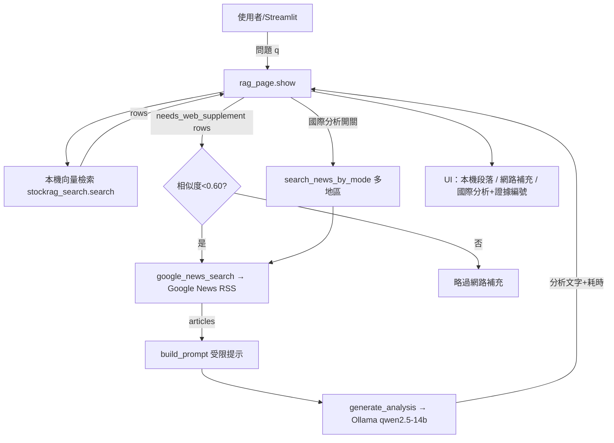
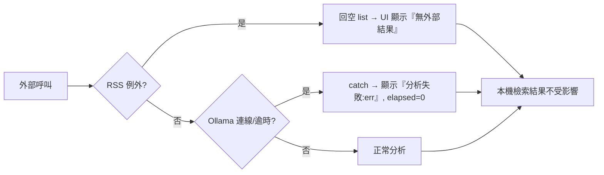

# 可行性評估報告 — RAG 頁「網路補充 / 國際新聞分析」

> 對象功能：`dashboard/pages/rag_page.py` 新增的「網路補充」與「國際新聞分析」，
> 依賴 `src/analysis/web_search.py`(Google News RSS 多地區) 與 `src/analysis/international_news.py`(Ollama LLM 受限分析)。
> 評估基準環境：Windows / Python 3.13、pytest 8.4、ruff 0.15；Streamlit/Playwright 未安裝；Ollama(172.16.9.27) 本機不可達。

## 1. 功能範圍
| 模組 | 職責 | 外部相依 |
|---|---|---|
| `web_search.google_news_search` | 單地區 RSS 檢索、解析、去重、fail-open | Google News RSS |
| `web_search.search_news_by_mode` | 多地區模式聚合（分組保留來源） | 同上 |
| `web_search.needs_web_supplement` | 依本機語意相似度決定是否補充 | 無 |
| `international_news.build_prompt` | 組出「僅含外部證據」的提示 | 無 |
| `international_news.generate_analysis` | 呼叫 Ollama 產生受限分析 | Ollama /api/generate |
| `rag_page.show` | Streamlit UI 整合與呈現 | Streamlit |

## 2. 可行性評估表（必含欄位）
| 項目 | 技術難易度(1–5) | 風險係數(1–5) | 預估開發時程 | 相依/前置 | 驗收門檻 |
|---|:--:|:--:|---|---|---|
| RSS 檢索與解析(regex) | 2 | 3 | 0.5 天 | requests | 單元測試涵蓋成功/失敗/去重 |
| 多地區模式聚合 | 2 | 2 | 0.5 天 | 上者 | 綜合模式分組順序穩定 |
| fail-open 降級 | 1 | 1 | 0.25 天 | 無 | 外部異常回空、不拋例外 |
| LLM 受限提示工程 | 3 | 4 | 1 天 | Ollama | 分析不逸出證據、固定四節 |
| Ollama 串接與逾時 | 3 | 4 | 0.5 天 | 網路/GPU | 逾時/連線失敗有降級訊息 |
| Streamlit UI 整合 | 2 | 2 | 1 天 | streamlit | 各 toggle 行為正確、空問題保護 |
| E2E(Playwright)+截圖 | 3 | 3 | 1 天 | playwright+streamlit | 4 情境腳本可重跑產截圖 |
| 資安/相依稽核 | 2 | 3 | 0.5 天 | pip-audit/ruff | 稽核表無未緩解高風險 |
| **合計** | — | — | **≈ 5.75 人日** | — | 全測試綠 + 稽核通過 |

風險係數定義：1 幾乎無風險 / 3 需設計緩解 / 5 可能阻斷交付。

## 3. 架構規劃圖

### 3.1 元件與資料流

### 3.2 失效降級路徑（可靠性關鍵）

## 4. 最沒把握的 3 件事（誠實揭露）
1. **LLM 是否真的「不逸出外部證據」** — `SYSTEM` prompt 已規範六條，但 14B 模型在證據稀少時可能腦補台股標的或因果。單元測試只驗證「提示內容」，**無法驗證模型輸出遵守度**；需離線紅隊測試 + 輸出後過濾（見文件2 P1 模組）。風險係數 4。
2. **Google News RSS 的穩定性與合法性** — 非官方 API，regex 解析對版面/CDATA 變動脆弱；可能遭速率限制或封鎖，且商用抓取條款存疑。目前只有「fail-open」保護，缺**快取、退避重試、來源條款確認**。風險係數 4。
3. **環境落差（Linux↔Windows、Ollama 可達性）** — 程式含硬編碼 `/home/mdsadmin/...` 與 `172.16.9.27:11434`；本評估機（Windows）無法實跑 Streamlit＋Ollama，**E2E 截圖與國際分析的實際輸出尚未在本機驗證**，僅單元層綠燈。風險係數 4。

## 5. 建議 Go/No-Go
- **Go（可上線）**：本機檢索 + 網路補充（fail-open 已足夠健壯）。
- **Conditional（需補件）**：國際新聞分析——上線前需完成「輸出後過濾 + RSS 快取/退避 + 設定外部化」三項緩解（詳見文件 2、4）。
