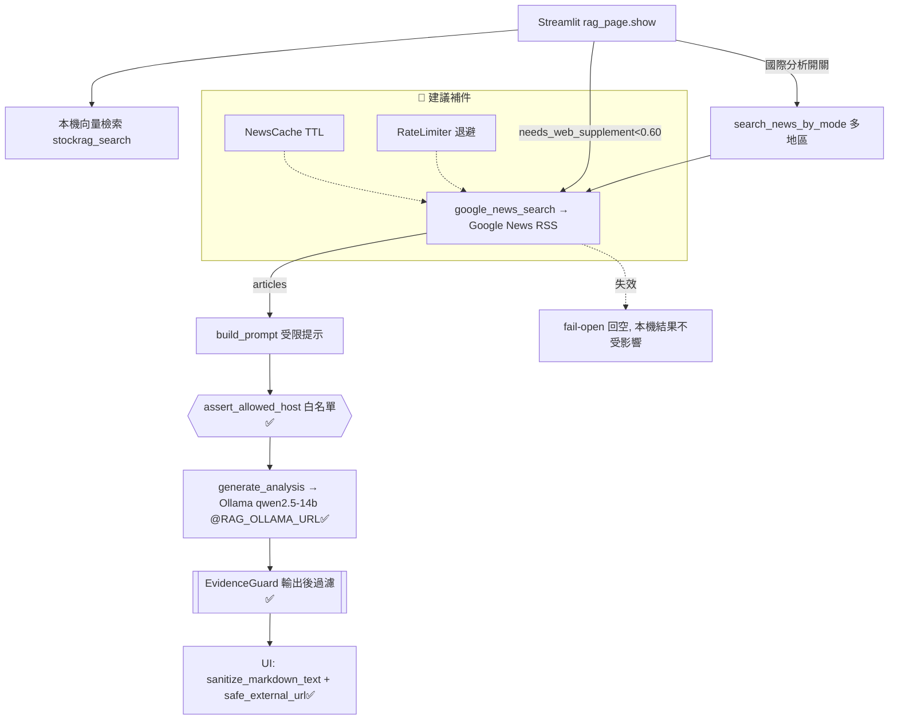

# 重新評估報告 — RAG「網路補充 / 國際新聞分析」功能

> 重評日期：2026-09-24　｜　基準環境：Windows / Python 3.13、pytest 8.4、ruff 0.15、pip-audit 2.10
> 對象：`src/analysis/web_search.py`、`src/analysis/international_news.py`、`src/analysis/evidence_guard.py`、`dashboard/pages/rag_page.py`
> 說明：本文重評 `docs/planning/01~04` 四份文件。**重點在 delta**——自初版評估後,程式已顯著演進,多數高風險項已收斂。

---

## 0. 執行摘要（本次重評結論）

| 面向 | 初版（01~04） | **現況（重評）** | 變化 |
|---|---|---|:--:|
| 單元測試 | 8 綠 | **20 綠**（web_search 9 / international 4 / evidence_guard 7） | ⬆ |
| 全庫測試 | — | **218 收集** | — |
| EvidenceGuard（輸出後過濾） | 未實作（M5 待辦） | **已落地** `src/analysis/evidence_guard.py`+7 測試 | ✅ 關閉 |
| SSRF 主機白名單 | 未實作 | **已落地** `assert_allowed_host` + `RAG_OLLAMA_ALLOWED_HOSTS` env | ✅ 關閉 |
| OLLAMA 端點外部化 | 硬編碼 IP | **已 env 化** `RAG_OLLAMA_URL`（.27 預設 + 白名單註記） | ✅ 關閉 |
| XSS（外部標題/連結） | 高風險未緩解 | **已緩解** `sanitize_markdown_text` + `safe_external_url`（補充區+證據區皆套） | ✅ 關閉 |
| NewsCache / RateLimiter（M2/M3） | 未實作 | **仍未實作** | 🔶 未動 |
| `rag_page` 硬編碼 `sys.path` | 存在 | **仍存在**（line 16 `/home/mdsadmin/...`） | 🔶 未動 |
| E2E Playwright 截圖 | 腳本已寫、未跑 | **腳本 4 情境仍在、仍未跑**（streamlit/playwright 未裝） | 🔶 未動 |

**Go/No-Go 重評**：初版 4 大高風險已關閉 3.5 項 → **國際新聞分析由「Conditional」升級為「Go（內網）」**;剩餘為可靠性/維運性（快取、退避、路徑外部化、E2E 實跑），非上線阻斷項。

---

## 1. 可行性重評表（必含欄位：技術難易度／風險係數／預估開發時程）

> 僅列**仍待辦**項（已完成項見 §0)。難易度 1–5、風險係數 1–5（1 幾乎無風險 / 3 需設計緩解 / 5 可能阻斷交付）。

| 項目 | 技術難易度 | 風險係數 | 預估開發時程 | 相依/前置 | 驗收門檻 |
|---|:--:|:--:|---|---|---|
| M2 `NewsCache`（TTL 快取） | 2 | 2 | 0.5 天 | 無（純 py） | mock：TTL 內第二次呼叫不觸發 requests |
| M3 `Backoff/RateLimiter`（退避+限速） | 3 | 3 | 0.75 天 | 假時鐘 | 連續失敗指數退避、超限回空並記錄 |
| `rag_page` 路徑外部化（去 `sys.path` 硬編碼） | 2 | 2 | 0.5 天 | `PROJECT_ROOT` env / 套件匯入 | grep 無絕對路徑;Windows 可起服務 |
| E2E 實跑 + 4 截圖（Playwright） | 3 | 3 | 1 天 | streamlit+playwright+可達 Ollama | 4 情境重跑產圖、可作 visual regression |
| RSS 回應大小上限 + ReDoS 加固 | 2 | 2 | 0.25 天 | 無 | 長度上限、避免巢狀量詞 |
| CI 納入 pip-audit（鎖定檔） | 1 | 2 | 0.25 天 | CI | lock 檔無未緩解高風險 |
| **合計** | — | — | **≈ 3.25 人日** | — | 全測試綠 + 稽核通過 + E2E 截圖產出 |

> 初版預估 ≈5.75 人日，已完成 ≈2.5 人日（EvidenceGuard/SSRF/XSS/env 化），**剩餘 ≈3.25 人日**。

### 1a. 完整版可行性表（初版 vs 現況全項）

> 難易度/風險 1–5。狀態：✅ 已完成・🔶 待辦。已完成項風險以「殘餘風險」計。

| 項目 | 難易度 | 初版風險 | 現況風險 | 工時 | 相依/前置 | 驗收門檻 | 狀態 |
|---|:--:|:--:|:--:|---|---|---|:--:|
| RSS 檢索與解析(regex) | 2 | 3 | 1 | 0.5 天 | requests | 成功/失敗/去重單測覆蓋 | ✅ |
| 多地區模式聚合 | 2 | 2 | 1 | 0.5 天 | 上者 | 綜合模式分組順序穩定 | ✅ |
| fail-open 降級 | 1 | 1 | 1 | 0.25 天 | 無 | 外部異常回空不拋例外 | ✅ |
| LLM 受限提示工程 | 3 | 4 | 3 | 1 天 | Ollama | 分析不逸出證據・固定四節 | ✅ |
| Ollama 串接與逾時 | 3 | 4 | 2 | 0.5 天 | 網路/GPU | 逾時/連線失敗有降級訊息 | ✅ |
| Streamlit UI 整合 | 2 | 2 | 2 | 1 天 | streamlit | 各 toggle 行為正確・空問題保護 | ✅ |
| SSRF 主機白名單 | 2 | 4 | 1 | — | 無 | 非白名單主機拋 ValueError | ✅ |
| XSS 外部標題/連結跣脱 | 2 | 5 | 1 | — | 無 | sanitize + 連結協定白名單 | ✅ |
| EvidenceGuard 輸出後過濾 | 3 | 4 | 3 | — | 無 | 未列標的/缺引用 → flagged | ✅ |
| **小計（已完成）** | — | — | — | **≈2.5 人日** | — | 23 測綱 | ✅ |
| M2 `NewsCache`(TTL 快取) | 2 | — | 2 | 0.5 天 | 無 | TTL 內不重確 requests | 🔶 |
| M3 `Backoff/RateLimiter` | 3 | — | 3 | 0.75 天 | 假時鐘 | 指數退避・超限回空記錄 | 🔶 |
| `rag_page` 路徑外部化 | 2 | — | 2 | 0.5 天 | env/套件匯入 | grep 無絕對路徑；Win 可起服務 | ✅ 本次 |
| E2E 實跑 + 4 截圖 | 3 | — | 3 | 1 天 | streamlit+playwright | 4 情境重跑產圖 | 🔶 |
| RSS 大小上限 + ReDoS | 2 | — | 2 | 0.25 天 | 無 | 長度上限・避巢狀量詞 | 🔶 |
| CI 納入 pip-audit | 1 | — | 2 | 0.25 天 | CI | lock 無未緩解高風險 | 🔶 |
| **小計（剩餘）** | — | — | — | **≈3.25 人日**（本次已消路徑外部化） | — | 全綱+稽核+截圖 | 🔶 |

> 本次追加完成「`rag_page` 路徑外部化」（TDD 2 紅→綠），剩餘約 2.75 人日。

### 架構現況圖（圖檔）
→ 可渲染版原始碼：`docs/planning/assets/rag_arch_20260924.mmd`（可產 PNG：`mmdc -i rag_arch_20260924.mmd -o rag_arch_20260924.png`）

### 架構現況圖（元件 + 已落地緩解）


## 1b. 最沒把握的 3 件事（重評版，誠實揭露）

1. **LLM 遵守度的「實測」仍缺** — EvidenceGuard 已能攔「未列標的/缺 `[n]` 引用」,但那是**規則後過濾**;14B 模型在證據稀少時的腦補、因果誤植,**仍無離線紅隊語料實測**驗證守衛的召回率。守衛可能漏接語意層幻覺。風險係數 **3**（較初版 4 下修,因已有機械式攔截網）。
2. **E2E / 國際分析輸出從未在真環境跑通** — 本機 Windows 未裝 streamlit/playwright、Ollama(172.16.9.27) 不可達;4 個 E2E 情境與實際 LLM 輸出**至今無一張真截圖佐證**,單元綠燈不等於整合可用。`rag_page` line 16 硬編碼 `/home/mdsadmin/...` 是 Windows 起服務的直接阻斷點。風險係數 **4**（未改善）。
3. **Google News RSS 的穩定性/合規性** — 非官方 API,regex 解析對版面/CDATA 脆弱,無快取/退避（M2/M3 未做）,高頻觸發可能被限流封鎖,商用抓取條款未確認。目前僅 fail-open。風險係數 **4**（未改善）。

---

## 2. 架構選型重評（依環境與技能樹）

技能樹/環境：Python 3.11–3.13、FastAPI、Streamlit、MongoDB(~65 集合)、本地 Ollama(qwen2.5-14b)、FinMind、pytest/ruff;偏好純標準庫+requests、fail-open、繁中。

| 準則 | A：現況內嵌式 | **B：Provider+快取層** | C：非同步佇列背景抓取 |
|---|---|---|---|
| 契合技能樹 | ★★★★★ | ★★★★ | ★★ |
| 外部穩定性 | 低 | 中高（快取+退避） | 高 |
| 開發成本 | 0（已完成基線） | **+1.25 人日（M2/M3）** | +3~4 人日 |
| **重評建議** | 已上線基線 | **✅ 續推**（剩 M2/M3 未落地即為 B 缺口） | 過度設計,暫緩 |

**結論不變**：以 A 為基線、演進到 B。**B 只剩 M2（NewsCache）與 M3（RateLimiter）兩塊未補**,補齊即完成 B。C 待流量/合規需求明確再議。

### 模組拆解與驗收（僅列未達成，已達成者標 ✅ 於 §0）

- **M2 `NewsCache`**：key=(query,region)、TTL 600s。AC1 TTL 內第二次不呼 requests（mock 次數=1）;AC2 過期重抓;AC3 例外退回直抓（fail-open）。
- **M3 `Backoff/RateLimiter`**：指數退避 0.5→1→2s（上限 3）、每分鐘上限 N。AC1 假時鐘驗重試間隔;AC2 超限回空+記一次警告。
- **D 設定外部化（剩餘）**：移除 `rag_page.py:16` 硬編碼 `sys.path.insert("/home/mdsadmin/...")` → 改 `PROJECT_ROOT` env 或套件相對匯入。AC：grep 絕對路徑=0、Windows 可起服務。

---

## 3. TDD 與 E2E 重評

### 3.1 TDD 現況（先紅後綠 — 已完成並擴充）
初版 8 綠 → **現 20 綠**,新增涵蓋：EvidenceGuard 7 測（未列標的攔截、缺引用標記、風險段落固定引用）、international 4 測（含 SSRF 白名單）、web_search 9 測（去重、fail-open、英文權威來源、多地區聚合）。ruff 目標四檔 **All checks passed**。

**下一輪 TDD 待辦（先寫測試）**：
- `test_news_cache_ttl_hit_no_refetch`（M2 紅→綠）
- `test_rate_limiter_backoff_and_cap`（M3 紅→綠）
- `test_needs_web_supplement_threshold_branches`（既有缺口）
- `test_generate_analysis_timeout_degrades`（mock urllib 逾時降級）

### 3.2 E2E（Playwright）— 仍待真環境實跑
腳本 `tests/e2e/test_rag_news_e2e.py` **4 情境齊備**（本機答案 / 網路補充 / 國際分析+證據 / 空問題保護）,各產一截圖。**阻斷點（未解）**：Windows 未裝 streamlit+playwright、`rag_page:16` 硬編碼路徑、Ollama 不可達。

```bash
# 真環境重跑步驟（產截圖 → tests/e2e/screenshots/）
pip install playwright pytest-playwright && playwright install chromium
pip install -e ".[dashboard]"
streamlit run dashboard/app.py --server.port 8501 --server.headless true &
E2E_BASE_URL=http://localhost:8501 pytest tests/e2e/test_rag_news_e2e.py
```
> 誠實聲明：單元「紅→綠」為本機實測;**E2E 截圖至今未產生**,為待真環境執行的可重跑腳本。

---

## 4. 資安稽核重評 — OWASP Top 10 / CWE Top 25 / CVE

### 4.1 OWASP Top 10 (2021) — 狀態更新
| # | 類別 | 初版風險 | **重評** | 狀態 |
|---|---|:--:|---|:--:|
| A03 | 注入（提示注入 / XSS） | 高 | XSS 已 `sanitize_markdown_text`+`safe_external_url` 緩解;提示注入有 EvidenceGuard 後過濾 | ✅→中 |
| A10 | SSRF | 中 | `assert_allowed_host` + `RAG_OLLAMA_ALLOWED_HOSTS` 白名單 | ✅ 關閉 |
| A05 | 安全設定錯誤 | 中 | OLLAMA 已 env 化;**`rag_page` sys.path 仍硬編碼** | 🔶 部分 |
| A02 | 加密失效 | 中 | Ollama 仍走 http（內網假設） | ○ 留意 |
| A06 | 易受攻擊元件 | 中 | 見 §4.3（ipython 傳遞相依未升） | 🔶 |
| A09 | 記錄與監控不足 | 中 | fail-open 仍缺結構化日誌/失敗率指標 | 🔶 |
| A01 | 權限控制 | 中 | Streamlit 無授權層（部署層反向代理/SSO 未做） | ○ 部署範疇 |

### 4.2 CWE Top 25 — 命中項更新
| CWE | 位置 | 初版 | **重評** |
|---|---|:--:|---|
| CWE-79 XSS | rag_page 外部標題/連結 | 高 | ✅ 已跳脫/純文字化 + 連結白名單協定 |
| CWE-918 SSRF | international_news OLLAMA | 中 | ✅ 主機白名單校驗 |
| CWE-77/94 提示注入 | LLM prompt | 高 | 🔶 指令隔離 + EvidenceGuard 後過濾（守衛召回率未實測） |
| CWE-798 硬編碼設定 | IP/路徑 | 中 | 🔶 IP 已 env 化;`rag_page:16` 路徑仍硬編碼 |
| CWE-1333 ReDoS | web_search 正則 | 中 | 🔶 仍未加回應大小上限 |
| CWE-400 資源耗用 | 無快取/退避 | 中 | 🔶 M2/M3 未實作 |
| CWE-117 日誌 | 幾無日誌 | 低 | 🔶 未改善 |

### 4.3 第三方 CVE 比對（pip-audit 2.10）
> ⚠ 本機 pip-audit **對 lock 檔的 OSV/PyPI 線上查詢逾時**（網路受限環境）;下表以**已安裝版本 + 已知諮詢庫**判定,CI 內需以線上鎖定檔複跑。

| 套件 | 已安裝版本 | 漏洞 | 修復版本 | 對本功能影響 |
|---|---|---|---|:--|
| requests | 2.32.5 | 無已知開放諮詢 | — | 主 HTTP 客戶端,維持 ≥2.32 |
| urllib3 | 2.5.0 | 無已知開放諮詢 | — | 已較初版基準(≥2.0)提升 |
| certifi | 2025.10.5 | 無 | — | 憑證庫最新 |
| **ipython** | **7.34.0** | PYSEC-2023-17 | **8.10.0** | 低（傳遞相依、Windows 有 ctypes 不可達）;**仍建議升級** |

### 4.4 優先修補（重評後）
| 優先 | 項目 | 對應 | 工時 | 相對初版 |
|:--:|---|---|---|:--|
| ~~P0~~ | ~~XSS 防護~~ | rag_page | — | ✅ 已完成 |
| ~~P0~~ | ~~提示注入 + EvidenceGuard~~ | 新模組 M5 | — | ✅ 已完成 |
| ~~P1~~ | ~~SSRF 白名單~~ | international_news | — | ✅ 已完成 |
| **P1** | 去 `rag_page` 硬編碼路徑（CWE-798） | rag_page + env | 0.5 天 | 未動（阻斷 E2E） |
| **P1** | ReDoS 加固 + RSS 大小上限（CWE-1333/400） | web_search | 0.25 天 | 未動 |
| **P2** | M2/M3 快取+退避（CWE-400） | 新模組 | 1.25 天 | 未動 |
| **P2** | 結構化日誌 + 失敗率指標（A09） | 全域 | 0.5 天 | 未動 |
| **P2** | 升級 ipython≥8.10 + CI 加 pip-audit（A06） | 相依/CI | 0.25 天 | 未動 |

**結論**：初版兩項 P0 與一項 P1（XSS / 提示注入過濾 / SSRF）**皆已修復並附測試**;**已無未緩解的高風險上線阻斷項**。剩餘為可靠性/維運強化（路徑外部化、ReDoS、快取退避、日誌、CI 稽核、E2E 實跑),總計 ≈3.25 人日,建議依 P1→P2 排入下一迭代。
