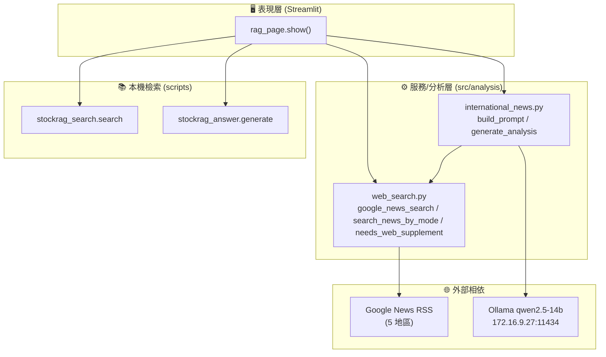
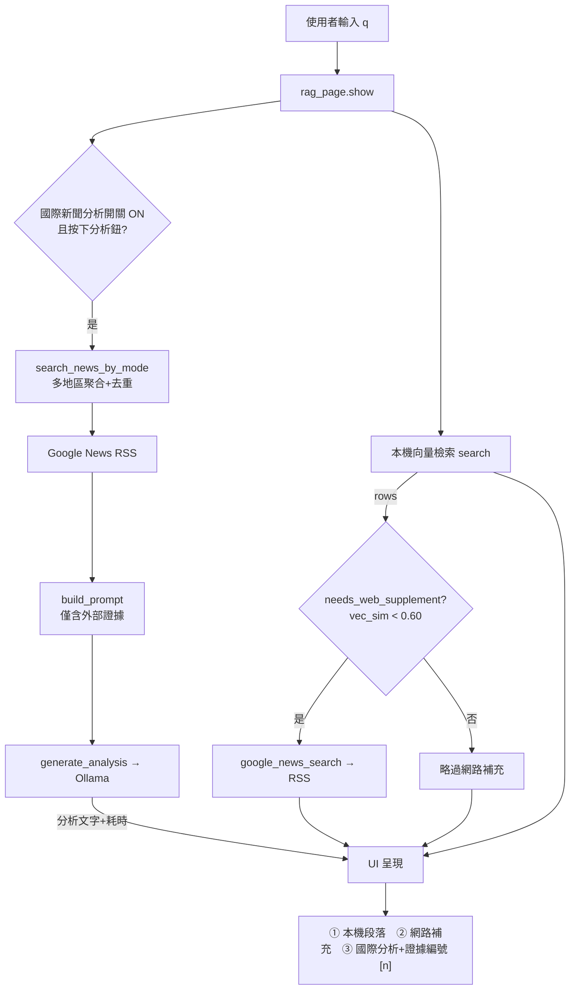
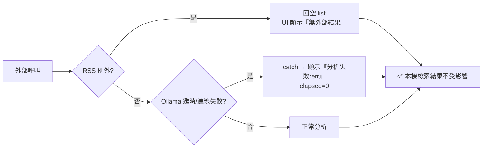
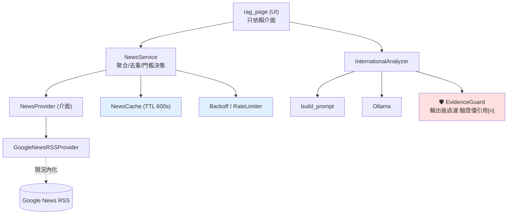
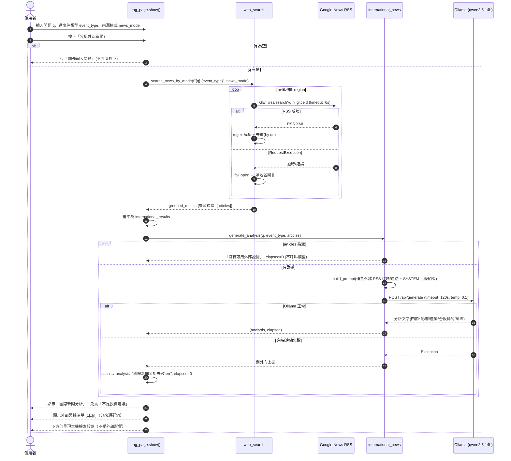

# 架構規劃圖 — RAG 頁「網路補充 / 國際新聞分析」

> 對象功能：`dashboard/pages/rag_page.py` + `src/analysis/web_search.py` + `src/analysis/international_news.py`
> 圖 1–3、5 為**已實作現況**（8 單元測試綠）；圖 4 為**建議演進（方案 B）**。

## 1. 系統分層架構

## 2. 元件與資料流（核心決策點）

## 3. 失效降級路徑（可靠性關鍵 — fail-open）

## 4. 目標演進架構（方案 B：Provider＋快取＋防護）

> 藍色＝降低「RSS 穩定性風險」的快取/退避；紅色＝降低「LLM 逸出證據風險」的輸出過濾。

## 5. 時序圖 — 一次「國際新聞分析」的完整呼叫順序

### 時序圖關鍵契約
| 步驟 | 契約 | 對應測試/文件 |
|---|---|---|
| 空問題保護 | 未輸入 q → 提醒且不外呼 | E2E `test_empty_question_guard` |
| RSS fail-open | 單一地區失敗回 `[]`，不中斷其他地區 | `test_google_news_search_fails_open_on_request_error` |
| 去重 | 相同 url 只留第一筆 | `test_google_news_search_deduplicates_by_url` |
| 證據受限 | prompt 僅含外部標題，禁用內部資料 | `test_build_prompt_limits_analysis_to_external_evidence` |
| 空證據守衛 | 無 articles → 不呼叫模型 | `generate_analysis` 前置判斷 |
| Ollama 降級 | 逾時/失敗 → 顯示失敗訊息，本機結果不受影響 | 失效降級路徑（圖 3） |
