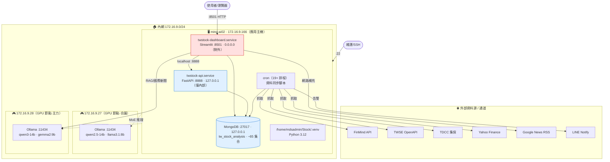
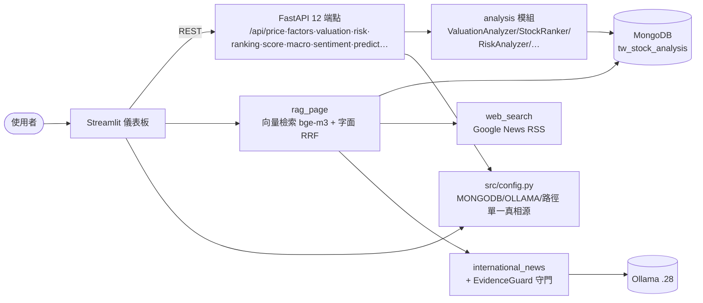
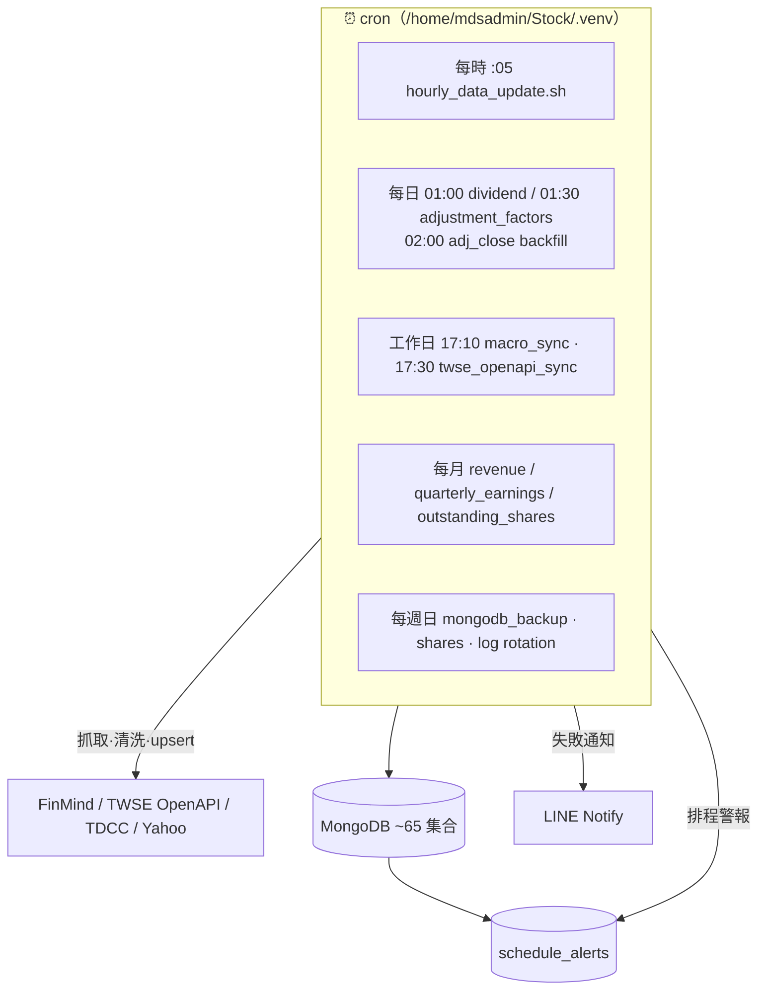
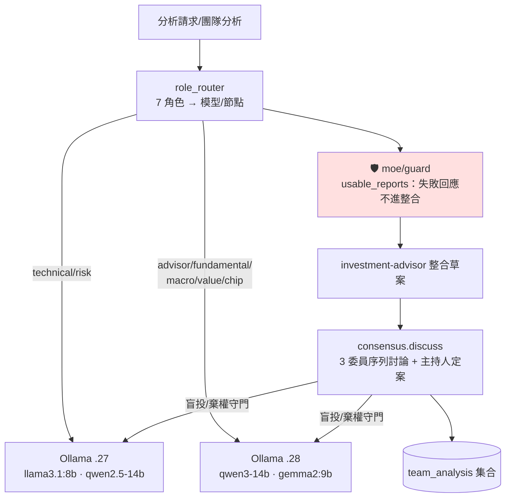
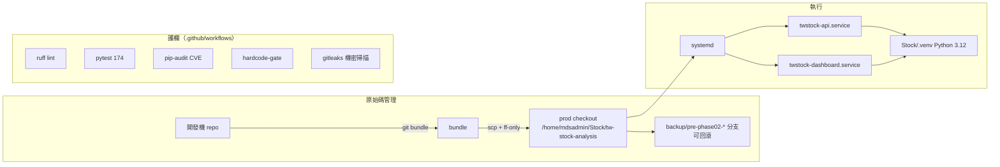
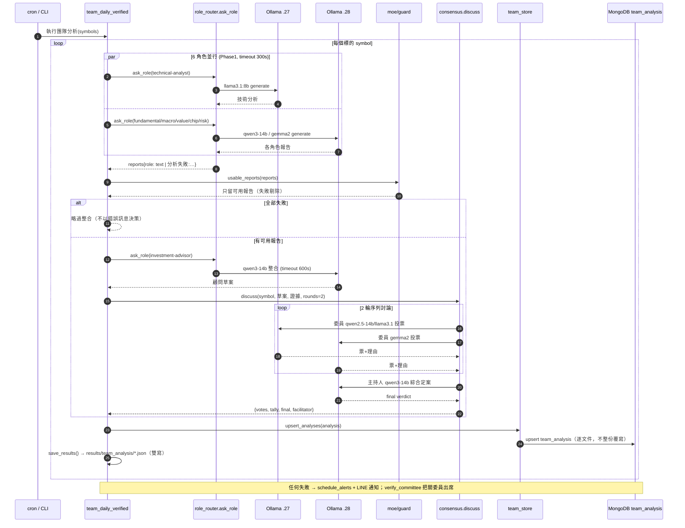
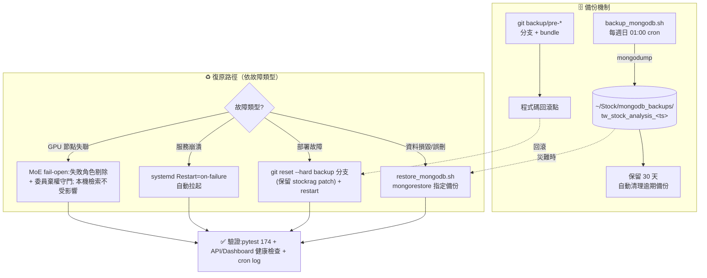

# 正式環境架構規劃圖 — tw-stock-analysis

> 環境：`ming-ai02` (172.16.9.166) + GPU 推理節點 .27/.28。基於實機盤點（systemd/ss/cron/.env）繪製。
> 部署版本：`89705ce`（Phase 0-2 + 修復）。日期基準：2026-09-22 上線。

## 1. 實體拓撲與網路安全邊界

> **安全邊界（實測 `ss -tlnp`）**：只有 `SSH(22)` 與 `Dashboard(8501, 0.0.0.0)` 對外；
> `API(8888)` 與 `MongoDB(27017)` 綁 `127.0.0.1` **僅內部可達**；Ollama 節點限內網。

## 2. 服務與資料流（主機 .166 內）

## 3. 資料匯入管線（cron 排程）

## 4. MoE / 多模型 AI 推理拓撲

> Phase 0 新增 `moe/guard`：角色 LLM 失敗回應（"分析失敗:…"）**不再計入**顧問整合與合議投票。

## 5. 部署與維運架構

## 6. 關鍵事實速查（實機盤點）
| 項目 | 值 |
|---|---|
| 應用主機 | ming-ai02 / 172.16.9.166 / Python 3.12 |
| 對外埠 | SSH 22、Dashboard 8501（0.0.0.0） |
| 內部埠 | API 8888、MongoDB 27017（皆 127.0.0.1） |
| GPU 推理 | .27（qwen2.5-14b/llama3.1）、.28（qwen3-14b/gemma2）Ollama :11434 |
| DB | MongoDB `tw_stock_analysis` ~65 集合 |
| 服務管理 | systemd：twstock-api / twstock-dashboard（Restart=on-failure） |
| 排程 | cron 19+（時/日/週/月資料同步 + 備份 + 告警） |
| 設定中心 | `src/config.py`（MONGODB/OLLAMA/路徑，env 覆寫） |
| 部署方式 | git bundle → ff-only + systemctl restart（backup 分支可回滾） |

## 7. 安全態勢摘要
- ✅ MongoDB / API 僅 `127.0.0.1`，未對外暴露。
- ✅ Ollama 限內網 GPU 節點。
- ✅ Phase 0 硬化：XSS 消毒、SSRF 白名單、提示注入/EvidenceGuard、MoE 決策守門。
- ✅ CI 護欄：ruff / pytest / pip-audit / 硬編碼 gate / gitleaks。
- ⚠️ Dashboard 8501 綁 `0.0.0.0`（內網對外）—— 建議評估加反向代理/SSO（Phase 3+）。

## 8. 時序圖 — 一次完整「團隊分析」呼叫順序
> 進入點 `scripts/team_daily_verified.py`（cron 或 CLI）；6 角色並行 → 守門過濾 → 顧問整合 → 合議定案 → 寫回 `team_analysis`。

## 9. 災難復原 / 備份流程

> **復原時間目標**：服務崩潰 systemd 自動拉起（秒級）；部署回滾 git reset + restart（分鐘級）；
> 資料復原 mongorestore（依資料量，數分鐘~數十分鐘）。**備份缺口**：目前每週備份，
> 週間資料損毀最多損失 ~7 天 —— 建議評估**每日 mongodump** 或 replica set（Phase 3+）。
